# 🔌 Energy Efficiency Business Coalition (EEBC)

### *Powering Colorado's Energy Future Through Collaboration*

---

## 🏗️ Who We Are

**EEBC** is Colorado's premier statewide trade association representing non-utility companies in the energy efficiency, demand response, and data analytics sectors. Since 2008, we've been the unified voice for businesses transforming Colorado's energy landscape.

### 🎯 Our Mission

> *Expand the energy marketplace for our member companies by advocating for programs that fund energy efficiency upgrades, influencing policies, and providing critical market intelligence.*

 

---

## ⚡ Quick Facts

<table>
<tr>
<td align="center" width="25%">
<h3>📅</h3>
<b>Founded</b> 
2008
</td>
<td align="center" width="25%">
<h3>🏢</h3>
<b>Organization</b> 
501(c)(6) Nonprofit
</td>
<td align="center" width="25%">
<h3>👥</h3>
<b>Member Companies</b> 
150+ Active
</td>
<td align="center" width="25%">
<h3>📍</h3>
<b>Coverage</b> 
Colorado & Southwest
</td>
</tr>
</table>

---

## 💡 What We Do

### 🏛️ **Policy & Advocacy**
- Primary voice for energy efficiency businesses at state legislature
- Representation at Public Utility Commission proceedings
- Direct engagement with Governor's office and Colorado Energy Office
- Deep advocacy for funding and financial incentives

### 🤝 **Industry Leadership**
- Unite the entire energy efficiency supply chain
- Facilitate collaboration between utilities and private sector
- Set standards for safety, quality, and professionalism
- Drive market transformation through innovation

### 📊 **Member Services**
- Quarterly membership meetings and networking events
- Legislative briefs and policy updates
- Market intelligence and trend analysis
- Exclusive Members Only resources and insights

### 🌱 **Economic Impact**
- Create sustainable jobs for long-term economic growth
- Promote cost-effective energy solutions
- Improve environmental and public health outcomes
- Support workforce development initiatives

---

## 🏆 Member Benefits

| Benefit | Description |
|---------|------------|
| **🗣️ Advocacy** | Professional representation at a fraction of individual cost |
| **🤝 Networking** | Connect with 150+ industry leaders and decision makers |
| **📚 Intelligence** | Access to exclusive market data and policy insights |
| **🎓 Education** | Professional development and training opportunities |
| **👥 Community** | Up to 10 employee seats at all member events |
| **💼 Visibility** | Enhanced business exposure and credibility |

> *"EEBC advocates on behalf of the energy efficiency industry at a fraction of the cost it would take us to cover these issues individually."*  
> — **Tim Jones**, Controls Leader • Ingersoll Rand/Trane

---

## 🏗️ Our Members

<b>Click to see member categories</b>

### Industry Sectors We Represent

- **🔧 Implementation & Evaluation**
  - Demand-side management experts
  - Program evaluation specialists
  
- **⚡ Demand Response**
  - Real-time energy management
  - Grid optimization services
  
- **🏭 Manufacturing & Distribution**
  - Energy efficiency equipment
  - Advanced building materials
  
- **📐 Engineering & Architecture**
  - Sustainable design professionals
  - Energy modeling experts
  
- **📊 Data Analytics**
  - Energy consumption analysis
  - Performance monitoring systems
  
- **🔨 Contractors**
  - Installation specialists
  - Retrofit professionals
  
- **💰 Financing**
  - Energy efficiency loans
  - Investment solutions
  
- **🏢 ESCOs**
  - Comprehensive energy services
  - Performance contracting
  
- **🎓 Workforce Development**
  - Training organizations
  - Certification programs
  
- **🌱 Nonprofits**
  - Mission-aligned organizations
  - Community programs

---

## 📈 Our Impact

---

## 🏛️ Organizational Structure

```mermaid
graph TD
    Board[Board of Directors] --> Exec[Executive Committee]
    Board --> Sectors[Sector Representatives]
    
    Exec --> Chair[Board Chair]
    Exec --> Vice[Vice Chair]
    Exec --> Sec[Secretary]
    Exec --> Treas[Treasurer]
    
    Sectors --> Mfg[Manufacturing & Distribution]
    Sectors --> Eng[Engineering & Architecture]
    Sectors --> Con[Contractors & Installation]
    Sectors --> ESCO[Energy Service Companies]
    Sectors --> Data[Data Analytics & Technology]
    Sectors --> Fin[Financing & Investment]
    
    Board --> ED[Executive Director]
    ED --> Staff[Professional Staff]
    ED --> Legal[Legal Counsel]
    ED --> Consult[Industry Consultants]
    
    style Board fill:#2E7D32,stroke:#1B5E20,stroke-width:2px,color:#fff
    style Exec fill:#388E3C,stroke:#2E7D32,stroke-width:2px,color:#fff
    style Sectors fill:#388E3C,stroke:#2E7D32,stroke-width:2px,color:#fff
    style ED fill:#0D47A1,stroke:#002171,stroke-width:2px,color:#fff
```

*View current board members: [EEBC Board of Directors](https://www.eebco.org/EEBC-Board-of-Directors)*

---

## 🚀 Get Involved

### Join EEBC Today

#### Three Ways to Connect

| **🌐 Visit** | **📧 Contact** | **🤝 Connect** |
|:---:|:---:|:---:|
| [Website](https://www.eebco.org/) | [admin@eebco.org](mailto:admin@eebco.org) | [LinkedIn](https://www.linkedin.com/company/energy-efficiency-business-coalition) |

### Why Join EEBC?

✅ **Expand Your Business** - Access new opportunities in Colorado's growing energy market  
✅ **Shape Policy** - Have a voice in regulations affecting your industry  
✅ **Build Connections** - Network with 150+ member companies  
✅ **Stay Informed** - Get exclusive market intelligence and policy updates  
✅ **Grow Together** - Collaborate to transform Colorado's energy future  

---

## 📞 Contact Information

**Energy Efficiency Business Coalition**  
📍 Lakewood, Colorado  
📞 (720) 274-9764  
✉️ [admin@eebco.org](mailto:admin@eebco.org)  
🌐 [www.eebco.org](https://www.eebco.org/)  

---

### 🌟 Building a Sustainable Energy Future Together

*EEBC - Where Energy Efficiency Means Business*

---

## 🙏 Acknowledgements

We extend our sincere gratitude to our key partners and supporters who help drive Colorado's energy efficiency industry forward:

### Featured Partners

- **[Johnstone Supply](https://www.johnstonesupply.com/)** - Leading HVACR distributor providing critical equipment and expertise to our contractor members
- **[Kontango Limited](https://www.kontango.com/)** - Strategic technology partner advancing data analytics and efficiency solutions

*These organizations exemplify the collaborative spirit that makes EEBC and Colorado's energy efficiency sector successful.*

---

© 2025 Energy Efficiency Business Coalition. All rights reserved.

