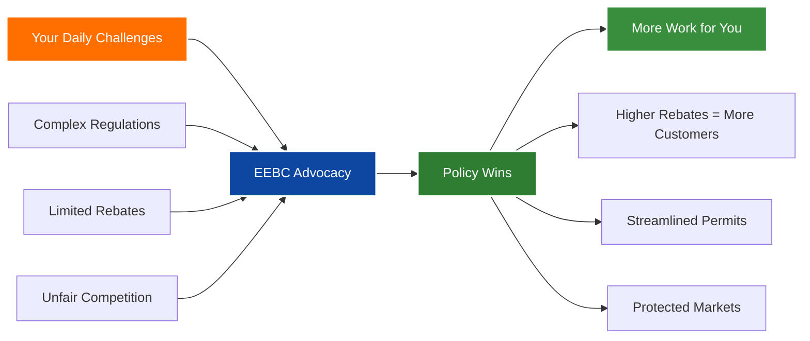
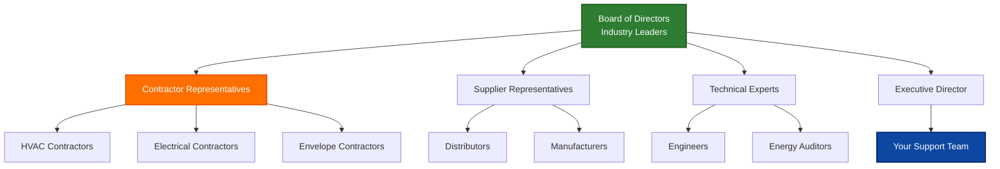

<div align="center">

# 🔌 Energy Efficiency Business Coalition (EEBC)

### *Built by Contractors, For Contractors - Growing Your Business Since 2008*

[](https://www.eebco.org/)
[](mailto:admin@eebco.org)
[](https://www.linkedin.com/company/energy-efficiency-business-coalition)
[](https://www.eebco.org/)

</div>

---

## 🔧 Why Contractors Join EEBC


**Stop leaving money on the table.** EEBC fights for the rebate programs and incentives that drive customers to YOUR business. We're the boots-on-the-ground organization that makes sure contractors have a seat at the table when utilities and government make decisions about energy efficiency programs.

### What's In It For You:

✅ **More Leads** - We advocate for rebate programs that send customers your way  
✅ **Better Margins** - Access to volume purchasing and preferred vendor programs  
✅ **Less Red Tape** - We fight excessive regulations and streamline certification requirements  
✅ **Industry Intel** - Know about policy changes BEFORE they affect your business  
✅ **Real Networking** - Connect with suppliers, GCs, and other trades at quarterly meetings  

<br clear="right"/>

---

## 💰 Current Opportunities for Contractors

<table>
<tr>
<td align="center" width="33%">
<h3>🏠</h3>
<b>Residential Rebates</b><br>
Heat pumps, insulation, smart thermostats
</td>
<td align="center" width="33%">
<h3>🏢</h3>
<b>Commercial Programs</b><br>
HVAC upgrades, lighting retrofits, controls
</td>
<td align="center" width="33%">
<h3>⚡</h3>
<b>Xcel Energy DSM</b><br>
Direct install programs with guaranteed work
</td>
</tr>
</table>

> *"EEBC advocates on behalf of the energy efficiency industry at a fraction of the cost it would take us to cover these issues individually."*  
> — **Tim Jones**, Controls Leader • Ingersoll Rand/Trane

---

## 📁 Contractor Resources Hub

```
EEBCO-Resources/
│
├── 🔨 contractor-toolkit/
│   ├── rebate-program-guide-2025.pdf
│   ├── certification-requirements.md
│   ├── insurance-guidelines.pdf
│   └── safety-standards/
│
├── 💼 business-development/
│   ├── marketing-templates/
│   ├── customer-education-materials/
│   ├── bid-calculators/
│   └── financing-options/
│
├── 📋 technical-resources/
│   ├── installation-best-practices/
│   ├── equipment-specifications/
│   ├── code-compliance-guides/
│   └── troubleshooting-guides/
│
├── 🤝 networking/
│   ├── member-directory/
│   ├── supplier-contacts/
│   ├── quarterly-meeting-schedule/
│   └── trade-events-calendar/
│
├── 📊 market-intelligence/
│   ├── upcoming-rebate-changes/
│   ├── policy-alerts/
│   ├── competitor-analysis/
│   └── wage-surveys/
│
└── 🎓 training-certification/
    ├── bpi-certification/
    ├── nate-programs/
    ├── manufacturer-training/
    └── apprenticeship-info/
```

### 🛠️ Most Used Resources

| Resource | What It Does for You |
|----------|---------------------|
| **[Rebate Program Guide](./contractor-toolkit)** | Complete list of current customer incentives you can leverage |
| **[Member Directory](./networking)** | Find suppliers, subs, and partners - all vetted EEBC members |
| **[Policy Alerts](./market-intelligence)** | Get notified BEFORE new regulations affect your work |
| **[Training Calendar](./training-certification)** | Free and discounted certification courses for members |
| **[Marketing Templates](./business-development)** | Ready-to-use materials to promote rebate programs to customers |

---

## 🏗️ How EEBC Works for Contractors



---

## 👥 Who's In EEBC

### Your Industry Partners:

<details>
<summary><b>Click to see who you'll be working with</b></summary>

- **🔧 HVAC Contractors** - Residential and commercial installers
- **💡 Electrical Contractors** - Lighting retrofit specialists  
- **🏠 Insulation Contractors** - Building envelope experts
- **🏭 Equipment Suppliers** - Johnstone Supply, Ferguson, Carrier dealers
- **📊 Energy Auditors** - BPI certified professionals
- **🏢 Mechanical Contractors** - Commercial system specialists
- **⚡ Controls Contractors** - Building automation experts
- **🚪 Window/Door Installers** - Envelope upgrade specialists
- **☀️ Solar Contractors** - PV and thermal installers
- **💰 Financing Partners** - Making projects affordable for customers

</details>

---

## 🎯 Membership Benefits That Matter

<div align="center">

| What You Get | Why It Matters |
|--------------|----------------|
| **Quarterly Meetings** | Network with GCs, suppliers, and get insider info on upcoming projects |
| **Advocacy Power** | We fight for contractor-friendly policies at the PUC and legislature |
| **Training Discounts** | Save on certifications like BPI, NATE, and manufacturer training |
| **Marketing Support** | Free templates and materials to promote rebate programs |
| **Technical Support** | Access to engineering expertise for complex projects |
| **Group Purchasing** | Better pricing through collective buying power |
| **Legal Updates** | Stay compliant with changing codes and regulations |
| **Lead Generation** | Get listed in our contractor directory used by customers |

</div>

---

## 📊 EEBC Board Structure



*Your voice matters - contractors make up the largest segment of our board*

---

## 🚀 Join EEBC Today

### Three Simple Steps:

1. **📞 Call us** at (720) 274-9764 or email [admin@eebco.org](mailto:admin@eebco.org)
2. **🤝 Attend a meeting** as our guest (lunch included!)
3. **💪 Start growing** your business with EEBC support

### Annual Membership Investment:

- **Individual Contractor**: Starting at $500/year
- **Small Business** (2-10 employees): $1,500/year  
- **Growing Business** (11-50 employees): $3,500/year
- **Large Contractor** (50+ employees): Custom pricing

*That's less than the profit from one rebate job - and we help you get dozens more*

---

## 📞 Get In Touch

**Energy Efficiency Business Coalition**  
📍 Lakewood, Colorado  
📞 (720) 274-9764  
✉️ [admin@eebco.org](mailto:admin@eebco.org)  
🌐 [www.eebco.org](https://www.eebco.org/)  

**Office Hours**: Monday-Friday, 8:00 AM - 5:00 PM MST  
**Emergency Policy Alerts**: Text "EEBC" to 720-XXX-XXXX

---

## 🙏 Acknowledgements

We extend our sincere gratitude to our key partners who support Colorado's contractors:

### Preferred Partners

- **[Johnstone Supply](https://www.johnstonesupply.com/)** - Leading HVACR distributor providing equipment, training, and technical support to our contractor members
- **[Kontango Limited](https://www.kontango.com/)** - Technology partner helping contractors streamline operations and improve profitability

*These organizations exemplify the collaborative spirit that makes EEBC and Colorado's contracting community successful.*

---

<div align="center">

### 🔨 Built by the Trades, For the Trades

*EEBC - Your Voice in Colorado's Energy Efficiency Industry*

[](https://sites.plane.so/intake/ac4ac84cd43f48279722b6b07761ed79/)

</div>

---

<div align="center">
<sub>© 2025 Energy Efficiency Business Coalition. All rights reserved.</sub>
</div>
